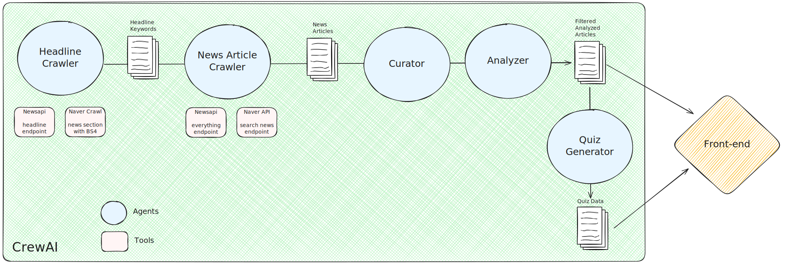

# QuizGenerator

## Overview

- Pipeline
  - News Crawler -> News Analyzer -> Quiz Generator -> (TODO) Quiz UI -> User
- Purpose
  - Generate daily quiz from news articles
  - User can enjoy the quiz and learn the news

## Motivation & Purpose
	- 많은 사람들이 뉴스를 읽는 데에 시간을 할애함
	- 재밋는 뉴스, 좋은 뉴스 퀴즈 시스템을 만들자

## Tech Stack
- CrewAI (Python)
- Front-end (Not yet decided)

## Architecture

### News Headline Crawler (Agent)
- Extract Hot topics of the day from the headlines
- LLM extracts the keywords from the headlines
- Source (w Tools)
	- NEWSAPI.org (deprecated due to the price)
	- Naver News with BS4
- Output
  - Keywords for each section (categories, e.g. politics, economy, etc.)

### News Crawler (Agent)
- Query the News arcitles using the Keywords
- Source (w Tools)
  - NEWSAPI.org (deprecated due to the price)
  - Naver News API (free for 25k requests)
- In / Out
	- Query -> Structured data (JSON)

### News Analyzer (Agent)
- Curate and analyze the news articles using LLM
- Role
  - Curate or filtering the articles (재미, 좋은)
  - Keyword tagging
  - Summarization

### AI Quiz Generation (Agent)
- Generate Quiz format using LLM based on the Anlayzed articles.

### Front-end (Not yet decided)
- Display the Quiz to the User
- User Feedback Data should be collected
